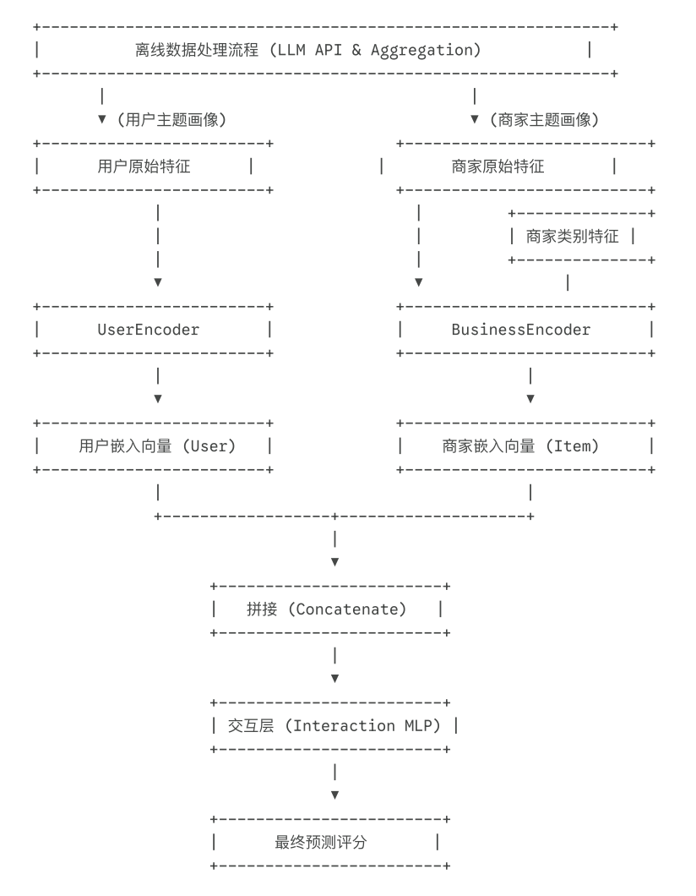

# Advanced Semantic-Enhanced Restaurant Recommendation System

This project is an advanced deep learning recommendation system implemented in PyTorch, designed to accurately predict user ratings for restaurants based on multi-dimensional user features and deep business attributes.

The core innovation of this project lies in its use of not only traditional user behavior and business attributes, but also **integrating large language models (LLMs) to perform topic analysis on large volumes of review text, building deep semantic profiles for both users and businesses**. This approach enables the model to understand the "why" behind ratings, achieving higher-dimensional and more precise personalized recommendations.

## Core Philosophy & Features

  * **Deep Semantic Understanding via LLM**: By calling large language models offline, unstructured review text is converted into structured "topic vectors". This provides the model with fine-grained insights into aspects such as service, quality, and atmosphere — something traditional methods cannot achieve.
  * **Purely Feature-Based**: The model's predictive capability comes entirely from learning user and business attributes (including semantic profiles), with no reliance on any ID embeddings.
  * **Ultimate Cold-Start Robustness**: Since no IDs are used, any new user or business with available features can be immediately processed by the model to generate meaningful recommendations, without retraining.
  * **Specialized Encoders**: Independent encoders (`UserEncoder` and `BusinessEncoder`) are designed separately for users and businesses, allowing specialized, asymmetric processing and optimization of features from different sources and of different types (numerical, categorical, semantic).
  * **Flexible Interaction Layer**: A "concatenation + MLP" approach is used to fuse the final vectors of users and businesses, capable of learning arbitrarily complex non-linear relationships between the two.
  * **Config-Driven & Modular**: The entire project is driven by YAML files under the `configs/` directory, with a clean architecture, decoupled modules, and ease of extension and maintenance.

## Architecture

The system architecture builds upon an advanced two-tower model, incorporating a powerful offline semantic feature engineering pipeline.



1.  **Offline Semantic Feature Engineering**: This is the starting point of the entire pipeline.

      * **Topic Generation**: The `scripts/generate_review_themes.py` script calls an external large language model (e.g., OpenAI API) to analyze each review and extract a set of predefined topics (such as "Staff Service & Attitude", "Product & Food Quality", etc.).
      * **Profile Aggregation**: The `src/data_processing/aggregate_themes.py` script reads the topic generation results and, through aggregation, generates a "**topic preference profile**" for **each user** (what the user cares about most) and a "**topic reputation profile**" for **each business** (which aspects are mentioned most often).

2.  **User Tower**: `UserEncoder` receives two types of features: traditional numerical user features (such as follower count, account age) and the newly generated "topic preference profile" vector. It uses an MLP network to deeply fuse this information and produce the final "user embedding vector".

3.  **Item Tower**: `BusinessEncoder` receives three core types of features: the business's **raw numerical features** (e.g., average star rating), **categorical features** (e.g., "Mexican Food", processed via `EmbeddingBag`), and the newly generated "**topic reputation profile**" vector. It also uses an MLP to deeply fuse information from these different sources and produce the "business embedding vector".

4.  **Interaction Layer**: The user and business vectors are **concatenated** and fed into an independent MLP network that learns complex interaction patterns and outputs the final predicted rating.

## Workflow

Please follow the steps below to run the complete project pipeline.

### 1\. Environment Setup

```bash
# Python 3.8+ is recommended
python -m venv venv
source venv/bin/activate  # On Windows: venv\Scripts\activate

# Install all dependencies
pip install -r requirements.txt
```

### 2\. Configure the API

To generate semantic features, you need to configure a large model API.

1.  Copy `configs/api_config.yaml.template` (if provided) or create a new file `configs/api_config.yaml`.
2.  Fill in your API key, Base URL, and model ID.
3.  **Important**: Add `configs/api_config.yaml` to your `.gitignore` file. **Do not** commit your keys to the repository.

### 3\. Complete Processing & Training Pipeline

In the project root directory, execute the following commands in order:

**Step 1 - Basic Data Preprocessing**

  * Filter restaurant-related reviews:
    ```bash
    python src/data_processing/filter_restaurants.py
    ```
  * Create a global mapping for business categories:
    ```bash
    python src/data_processing/create_mappings.py
    ```
  * Split the dataset into training and test sets:
    ```bash
    python src/data_processing/split_dataset.py --test_size 0.2
    ```

**Step 2 - Generate Advanced Semantic Features (time-consuming)**

  * Call the LLM API to generate topic labels for each review. This process supports **checkpoint resumption**.
    ```bash
    python scripts/generate_review_themes.py
    ```
  * Aggregate topic labels to create topic profiles for users and businesses.
    ```bash
    python src/data_processing/aggregate_themes.py
    ```

**Step 3 - Train the Model**
Run the main training script. It will automatically load all processed features (including semantic profiles), build the model, and start training.

```bash
python src/train.py
```

**Step 4 - Evaluate the Model**
After training, run the evaluation script to assess the model's performance on the test set.

```bash
python src/evaluate.py
```

## File Structure

```
.
├── configs/
│   ├── api_config.yaml      # (Create manually) Stores API keys and other sensitive information
│   └── config.yaml          # Core configuration file (model architecture, hyperparameters, paths)
├── data/
│   ├── unprocessed/         # Stores the raw Yelp dataset
│   └── processed/           # Stores all preprocessed data
├── saved_models/
│   ├── best_model.pt        # Trained best model weights
│   └── category_map.pkl     # Global category mapping file
├── scripts/
│   └── generate_review_themes.py # Script for calling LLM API to generate topic labels
├── src/
│   ├── data_processing/     # Data preprocessing scripts (filtering, splitting, aggregating, etc.)
│   ├── model/
│   │   ├── encoders.py      # UserEncoder and BusinessEncoder
│   │   └── two_tower.py     # Two-tower model body and interaction layer
│   ├── training/
│   │   └── trainer.py       # General-purpose trainer class
│   ├── dataset.py           # PyTorch Dataset class, responsible for loading all features
│   ├── train.py             # Main training script
│   └── evaluate.py          # Main evaluation script
└── README.md                # This file
```
